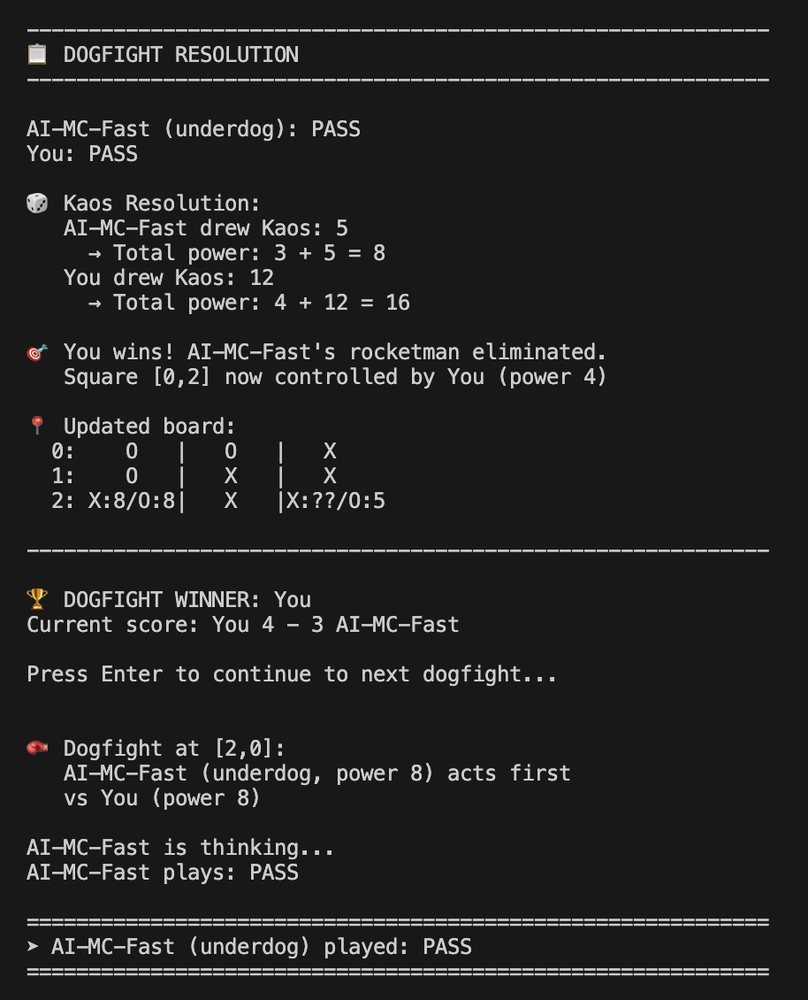

# Games and Game AI

## Project Ethos

These projects are about:
- understanding algorithms by building them
- seeing how different approaches *think*
- learning by stripping problems down to their **nuts and bolts**

Everything is text-based, inspectable, and hackable.

---

# Utala: KAOS 9 - A competitive 2-player tactical duel playable with any standard 52-card deck

[Read or Print the Utala: KAOS 9 Game rules](utala-kaos-9-rules.pdf)

[View the Utala: KAOS 9 Game Folder](./utala/kaos9/)

Download and play the game (requires Python)



## Quick Start

```bash
# Setup
./setup.sh              # Creates Python 3.11 venv and installs dependencies

# Play the game yourself
./run.sh                # Play as human vs AI (default)

# Watch AI vs AI demos
./run.sh demo.py        # Quick tournament view
./run.sh demo_heuristic.py      # Verbose gameplay
./run.sh demo_montecarlo.py     # Monte Carlo analysis

# Run tests
python run_tests.py     
```


# Phase 1 — Baselines and instrumentation (no learning) - COMPLETE

**Question:**  
_Do I understand the game well enough to measure anything at all?_

### Scope
- Implement the full game rules in Python (canonical for the study)
- Ensure determinism:
  - explicit RNG
  - versioned replay format
- Build an evaluation harness:
  - self-play
  - cross-play
  - tournament metrics

**Note:**  
All randomness lives in the **engine**, never in agents.  
Agents observe sampled state; they do not own RNG.

### Agents
Implement several **fully readable** agents:
- random legal
- simple heuristics
- rollout-based evaluator (Monte Carlo)

No learning.  
No gradients.  
No frameworks.

**Note:**  
Rollouts simulate *legal futures only*.  
If an agent proposes an illegal action, it is a bug in the agent, not the engine.

### Deliverables
- canonical Python engine
- replay format v1 (seed + action list)
- baseline agents ordered by strength
- bulk evaluation results

---

## Checkpoint — is the game worth studying? - PASSED

This checkpoint exists **before any learning is added**.

**Pass if:**
- stronger baseline agents consistently outperform weaker ones
- weaker agents still win sometimes
- different strategies produce different outcomes
- randomness affects *close* matches, not everything

---

## License

Source code is licensed under the MIT License.

The game name "utala: kaos 9", rulebook text, and branding are © 2026 David Benoy. All rights reserved.