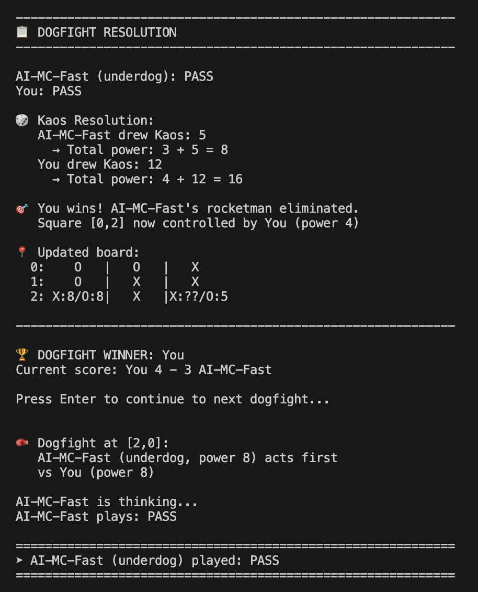

# Aerythen card game rules and AI development early stages archive

## UPDATE July 20206

This repository contains the artificial intelligence source code driving the [Aerythen interactive demo](https://aerythen.com/demo). 

Aerythen is a Dark Aero Command Line Punk universe created by [David Benoy](https://aerythen.com). The overarching project bridges together art, software development, an upcoming card game, and a developing series of companion novels.

### Explore the Universe
* 🎮 **Experience the code in action:** [Play the Aerythen Demo](https://aerythen.com/demo)
* 📖 **Dive into the lore:** [Read Utala - An Aerythen Novel](https://mybook.to/utala)

---

## Development Project Ethos

This project was about:
- understanding algorithms by building them
- seeing how different approaches *think*
- learning by stripping problems down to their **nuts and bolts**

Everything is text-based, inspectable, and hackable.

**Utala: KAOS 9** was the working title for the game during development.

A competitive 2-player tactical duel playable with any standard 52-card deck.

[Read or Print the Game Rules (PDF)](utala-kaos-9-rules.pdf) | [View the Game Folder](./utala/kaos9/)



## Live Player

Deployed automatically via GitHub Pages on pushes to `main`.

**[Play online](https://benwaar.github.io/games/)**

## Quick Start

```bash
cd utala/kaos9
./setup.sh              # Python 3.11 venv + dependencies
./run.sh                # Play as human vs AI
make test               # Run tests
```

---

## AI Research Phases

### Phase 1 — Baselines (no learning) — COMPLETE

Canonical Python engine, deterministic replay, evaluation harness. Baseline agents: random legal, heuristic, Monte Carlo rollout.

**Checkpoint: Is the game worth studying? PASS** — Heuristic 65% vs Random, Monte Carlo 79% vs Random. Clear skill gradient with meaningful variance.

### Phase 2 — Learning without frameworks — COMPLETE

Hand-built TD-linear value agent with manual gradient updates. Fixed state encoding, fixed action space, illegal actions masked by engine. Plateau ~47% vs Heuristic.

### Phase 3 — Deep learning — COMPLETE

DQN with bluffing-aware 80-dim state features (39K params). Imitation learning to distill search/DQN into tiny production models.

### Phase 4 — Rule evolution — COMPLETE

Variant A (v1.9): choosable dogfight order — winner picks the next contested square. Action space grows from 86 to 95. All agents retrained and validated on new rules.

**Checkpoint: Is the game rich enough to require deep learning? PASS** — DQN reaches 53% vs Heuristic (peak), linear models plateau at 38%.

### Phase 5 — Improve, distill, ship — COMPLETE

Improved DQN to consistent >50% vs Heuristic. Distilled into tiny production model. Variant A rules and distilled agent ported to the Flutter game app.

---

## License

This Source code is licensed under the MIT License.

Aerythen, the associated artwork, the game name "utala: kaos 9", rulebook text, and branding are © 2026 David Benoy. All rights reserved.