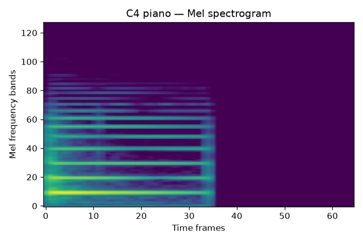

# Learning Hub

Concepts, visualisations, and code — one place for all projects in this programme.
Each section explains why a technique exists, shows what it looks like in practice, and links to the code that produced it.

---

## Signal Processing & Data Pipelines

| Concept | What it shows | Code |
|---------|--------------|------|
| [Reading Waveforms & Spectrograms](reading-plots.md) | Waveform and Mel-spectrogram from a real recording | [pipeline/ingest.py](../signal-hunt/pipeline/ingest.py), [pipeline/features.py](../signal-hunt/pipeline/features.py) |
| [Mel-Spectrograms](mel-spectrograms.md) | STFT → Mel scale → log-dB → tensor, with piano spectrogram example | [pipeline/features.py](../signal-hunt/pipeline/features.py) |
| [Signal-to-Noise Ratio](snr.md) | Why SNR matters for augmentation | [pipeline/augment.py](../signal-hunt/pipeline/augment.py) |
| [Data Collection](data-collection.md) | Why real recordings, labelling strategy | [data/raw/](../signal-hunt/data/raw/) |
| [Batch Processing](batch-processing.md) | Augmentation strategy, manifest schema | [pipeline/batch.py](../signal-hunt/pipeline/batch.py) |

### Waveform and spectrogram from Signal Hunt Phase 1

---

## Model Training

| Concept | What it shows | Code |
|---------|--------------|------|
| [Train / Val / Test Split](train-val-test-split.md) | Why three sets, stratification, no-peeking rule | [model/dataset.py](../signal-hunt/model/dataset.py) |
| [Dataset & DataLoader](dataset-dataloader.md) | PyTorch Dataset protocol, label encoding, batching | [model/dataset.py](../signal-hunt/model/dataset.py) |
| [Training Loop](training-loop.md) | Loss curves, Adam, scheduling, early stopping | [model/train.py](../signal-hunt/model/train.py) |
| [Evaluation](evaluation.md) | Precision, recall, F1, confusion matrix | [model/evaluate.py](../signal-hunt/model/evaluate.py) |

### Loss curves — Signal Hunt Phase 2 (hum/whistle/clap classifier)

### Confusion matrix — Signal Hunt Phase 3 (piano note classifier, 12 classes)

---

## Architectures

| Concept | What it shows | Code |
|---------|--------------|------|
| [CNN Architecture](cnn-architecture.md) | Conv2d, BatchNorm, ReLU, MaxPool, Global Average Pooling | [model/cnn.py](../signal-hunt/model/cnn.py) |
| [Transfer Learning](transfer-learning.md) | Frozen vs fine-tune, scratch comparison, per-note results | [model/transfer.py](../signal-hunt/model/transfer.py), [model/transfer_train.py](../signal-hunt/model/transfer_train.py) |

### Piano C4 spectrogram — harmonic ladder visible

---

## Reinforcement Learning

| Concept | What it shows | Code |
|---------|--------------|------|
| [Reinforcement Learning](reinforcement-learning.md) | MDP, TD, DQN, curriculum, distillation, self-play | [src/utala/deep_learning/](../utala/kaos9/src/utala/deep_learning/) |

### Agent strength ladder — all agents vs Heuristic (Variant A, corrected)

### DQN placement preferences — first move in 500 games

### DQN Q-values at game start — what each piece is worth where

---

## Python & PyTorch Foundations

| Concept | What it covers |
|---------|---------------|
| [Python Concepts](python-concepts.md) | Tuples, type hints, dataclasses, comprehensions, dunder methods — with C/JS/TS callouts |
| [Key Libraries](libraries.md) | NumPy, librosa, PyTorch (`nn`, `optim`, `DataLoader`), checkpoint save/load, `requires_grad` |

---

## Projects

| Project | Phase | Key explainers used |
|---------|-------|---------------------|
| [Signal Hunt](../signal-hunt/) | Ph 1–2 complete, Ph 3 complete, Ph 4 planned | Mel-spectrograms, CNN, training loop, evaluation, transfer learning |
| [Utala KAOS 9](../utala/kaos9/) | Ph 1–5 (re-train in progress) | Reinforcement learning, model distillation |
| [Acoustic Odyssey: cast](../acoustic-odyssey/cast/) | Planned | ONNX, quantisation, edge deployment |
| [Acoustic Odyssey: echo](../acoustic-odyssey/echo/) | Planned | MDP, Q-learning, adaptive systems |
| [Artefact: dig](../artefact/dig/) | Planned | Autoencoders, anomaly detection |
| [Artefact: bloom](../artefact/bloom/) | Planned | U-Net, super-resolution |
