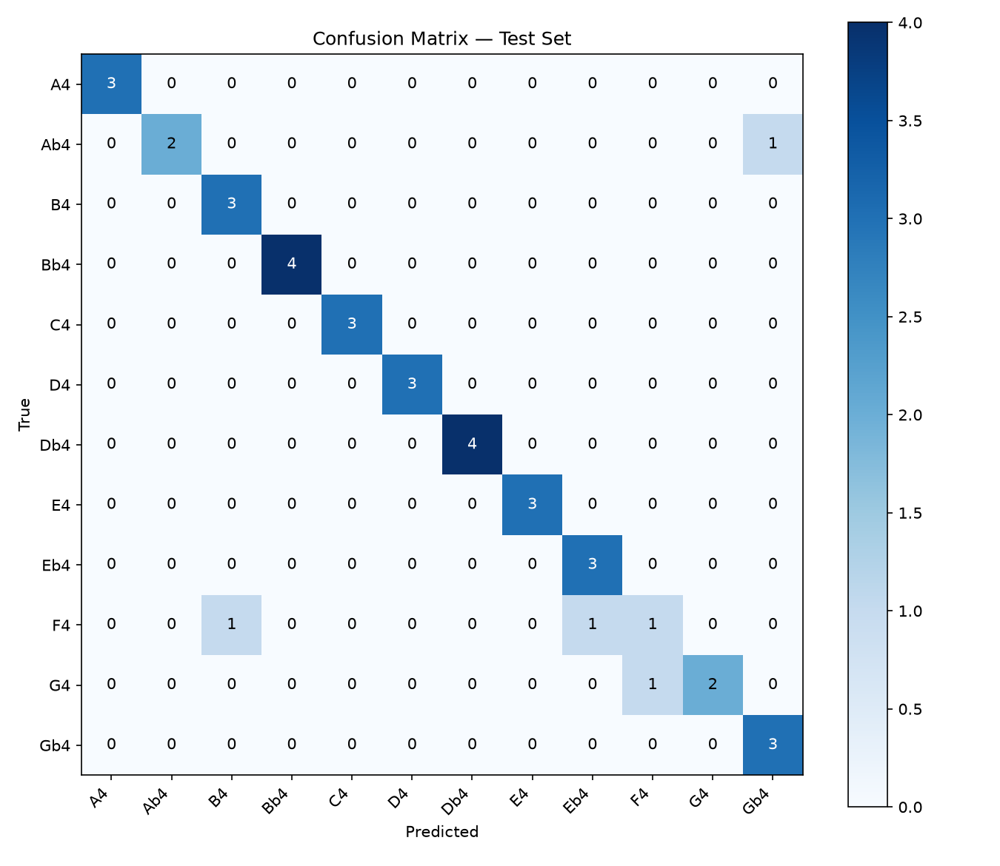
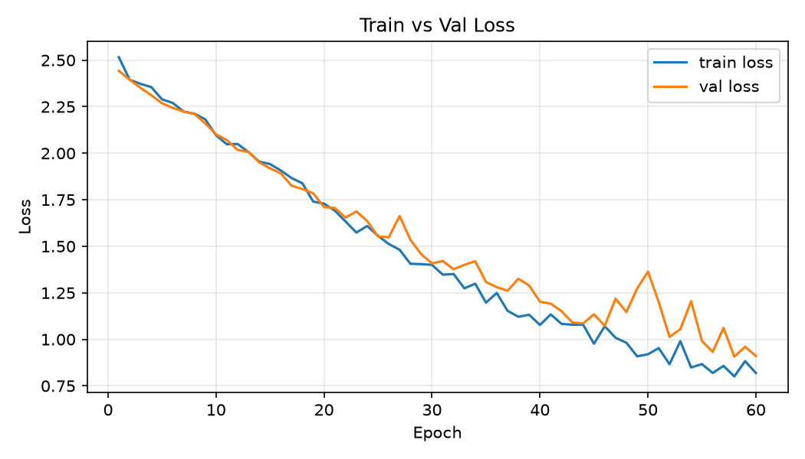

# Evaluation — Measuring What the Model Actually Learned

Accuracy alone doesn't tell you enough. These tools reveal *where* the model
succeeds, *where* it fails, and whether the failure makes sense.

---

## Why accuracy isn't enough

A 3-class classifier with 90% accuracy sounds good. But if 80% of your test
samples are class A and the model just predicts A every time, it gets 80%
accuracy for free — without learning anything.

The metrics below reveal the full picture.

---

## Precision, Recall, and F1

These three numbers describe performance *per class*, not just overall.

**Precision** — of everything the model said was class X, how many actually were?

```
precision = true_positives / (true_positives + false_positives)
```

High precision = low false alarm rate. "When the model says hum, it's usually right."

**Recall** — of everything that actually was class X, how many did the model catch?

```
recall = true_positives / (true_positives + false_negatives)
```

High recall = low miss rate. "The model rarely misses a real hum."

**F1** — harmonic mean of precision and recall. A single number that balances both.

```
F1 = 2 × (precision × recall) / (precision + recall)
```

> **Coming from C/JS/TS:** Think of precision and recall as two sides of a search
> problem. Precision is "how many of my search results were relevant?" Recall is
> "how many of the relevant documents did my search return?" Maximising one tends
> to hurt the other — a search that returns everything has perfect recall but
> terrible precision. F1 is the balance point.

> **In practice:** In fraud detection, recall matters more than precision —
> missing a fraud (low recall) is worse than a false alarm (low precision).
> In medical screening, same logic. In our sound classifier, we care about both
> equally — all three sound types matter — so F1 is the right summary metric.

**`sklearn.metrics.classification_report`** prints all three per class plus
weighted averages, in one call:

```python
from sklearn.metrics import classification_report
print(classification_report(true_labels, predicted_labels, target_names=class_names))
```

---

## Confusion matrix

A confusion matrix shows which classes the model confuses with which.
Rows = true class, columns = predicted class. Diagonal = correct predictions.

```
              Predicted
              clap  hum  whistle
True  clap  [  12    0      0  ]  ← all claps correctly identified
      hum   [   0   11      0  ]
      whistle[  0    0     12  ]
```

A perfect classifier has non-zero values only on the diagonal. Off-diagonal
entries tell you *which* mistakes the model makes — and whether they make sense.

For our task, the interesting confusions would be:
- **hum ↔ whistle** — both are sustained tones. If the model confuses them,
  the frequency separation in the spectrogram isn't reliable enough.
- **clap ↔ anything** — claps are broadband transients; they look nothing like
  tones. Confusion here would suggest a pipeline bug, not a model limitation.

> **Coming from C/JS/TS:** A confusion matrix is a 2D error breakdown — like a
> test results matrix crossed with a category report. Rows are what you expected,
> columns are what you got. The off-diagonals are the misclassifications.

---

## Loss curves

Plotting train loss and val loss over epochs reveals the training dynamics:

```
loss
1.1 |●
    | ●●
0.8 |   ●●●
    |      ●──────────────────────
0.5 |      ●─────────────────────  ← val loss
    |           ●●●●●●●●●●●●●●●●  ← train loss (lower = model fit training harder)
0.3 |
    └─────────────────────────────  epoch
     0    10    20    30    40
```

**What to look for:**

| Pattern | Meaning |
|---------|---------|
| Both losses decreasing together | Healthy learning |
| Val loss rising while train falls | Overfitting — model memorising training data |
| Both losses flat from epoch 1 | Not learning — check LR, data, architecture |
| Loss goes to NaN | LR too high, or a numerical bug |
| Val loss lower than train loss | Usually small val set noise; or dropout is too high |

The point where val loss stops improving (before early stopping kicks in) is the
model's best generalisation — the checkpoint saved there is what we use for inference.

---

## What our run showed

```
Best checkpoint: epoch 41 | val_loss=0.302 | val_acc=0.971
Test set result: loss=0.324 | acc=1.000

              precision  recall  f1-score  support
        clap       1.00    1.00      1.00       12
         hum       1.00    1.00      1.00       11
     whistle       1.00    1.00      1.00       12
    accuracy                         1.00       35
```

Perfect precision, recall, and F1 across all three classes on the held-out test set.
The confusion matrix is a clean diagonal — no cross-class errors.

**What this proves:** the three sound types are spectrally separable from their
Mel-spectrograms, and a 25K-parameter CNN trained for 46 epochs on 161 samples is
sufficient to learn that separation. No false alarms, no misses.

**The caveat:** 35 test samples is a small number. One unlucky recording — a hum
recorded in a noisy room that augmentation pushed to sound like static — could change
this. The result is promising, not definitive. Phase 3 will use more data and more
classes, which will give a more robust signal.

---

## Plots from our run

**Confusion matrix** — test set, 35 samples:



Clean diagonal. No off-diagonal errors — every clap, hum, and whistle correctly identified.

**Loss curves** — 46 epochs, early stop:



**What we were looking for:**

The ideal shape is both lines decreasing together, then val loss flattening while
train loss continues very slowly — a small, stable gap. That's a model that has
learned the training data well and generalises to new data.

The bad shape to watch for is a V-split: val loss starts rising while train loss
keeps falling steeply. That's overfitting — the model is memorising training examples
rather than learning patterns. The wider the gap, the worse the overfit.

**What we actually see:**

- **Epochs 1–10:** Both losses fall steeply together from ~1.09 (random) to ~0.80.
  The model is learning fast — the three sound types are very different spectrally.
- **Epochs 10–30:** Continued joint decrease, slowing down. Val loss slightly noisier
  than train (expected — 35 val samples vs 161 train).
- **Epoch 29:** First LR reduction (1e-3 → 5e-4). Visible as a slight change in
  descent rate. The scheduler detected a plateau and halved the step size to let
  the optimiser converge more finely.
- **Epochs 30–41:** Val loss reaches its best (0.302 at epoch 41). Train loss
  continues falling more steeply — the gap at this point is ~0.05, which is small.
- **Epoch 45:** Second LR reduction (5e-4 → 2.5e-4). Near the end of useful training.
- **Epoch 46:** Early stop. Val loss hasn't improved for 5 epochs.

**Why the gap is OK:**

The train/val gap at early stop (~0.09) is mild. A gap of this size on a dataset
of 161 training samples is expected — there isn't enough data for the model to
fully generalise without any gap at all. Dropout is keeping it in check; without
it the gap would be larger and the test accuracy likely lower.

The test set confirms this: loss=0.324, acc=1.000. The val loss (0.302) and test
loss (0.324) are very close, which means the val set was a reliable proxy for
generalisation — the model didn't just tune to it.

---

## End-to-end inference

`python -m model.predict data/raw/hum/h-1.wav --verbose`

```
--- hum ---
hum (58.8% confidence)
         hum: 58.8%
     whistle: 30.9%
        clap: 10.3%

--- whistle ---
whistle (75.6% confidence)
     whistle: 75.6%
        clap: 18.5%
         hum: 5.9%

--- clap ---
clap (97.4% confidence)
        clap: 97.4%
     whistle: 1.7%
         hum: 0.9%
```

All three predicted correctly. The confidence spread tells a story.

**Clap at 97.4%** is the most certain. Claps are broadband transients — a burst across
all frequencies at once. Nothing else looks like that on a Mel-spectrogram. The model
has no doubt.

**Whistle at 75.6%** is reasonably confident, with clap getting 18.5%. A little
surprising — you might expect whistle/hum confusion (both sustained tones) rather
than whistle/clap. This is likely the specific recording: if the whistle had a sharp
onset or was short, it could resemble the broadband burst of a clap.

**Hum at 58.8%** is the least certain, with whistle getting 30.9%. This makes
sense acoustically — hums and whistles are both sustained tones. They differ mainly
in frequency (hum is low, whistle is high), but a hum pitched high or a whistle
pitched low can occupy overlapping Mel bins. With more training data and more varied
pitches, this gap should widen.

**Why confidence is lower than test accuracy suggests**

The test set showed 100% accuracy, but test accuracy is binary (right or wrong) —
it doesn't capture how uncertain the model was on borderline predictions. A 58.8%
confidence on the correct class is still a correct prediction, but it signals the
model isn't far from being wrong. On a harder dataset (Phase 3, 12 pitch classes)
this kind of borderline confidence will become actual errors.

**Pipeline consistency confirmed** — the fact that these predictions are correct
at all proves that `pipeline.ingest` and `pipeline.features` produce identical
tensors at inference time as at training time. If there were any preprocessing skew
(different normalisation, different frame count), the model would produce random
outputs. It doesn't.
