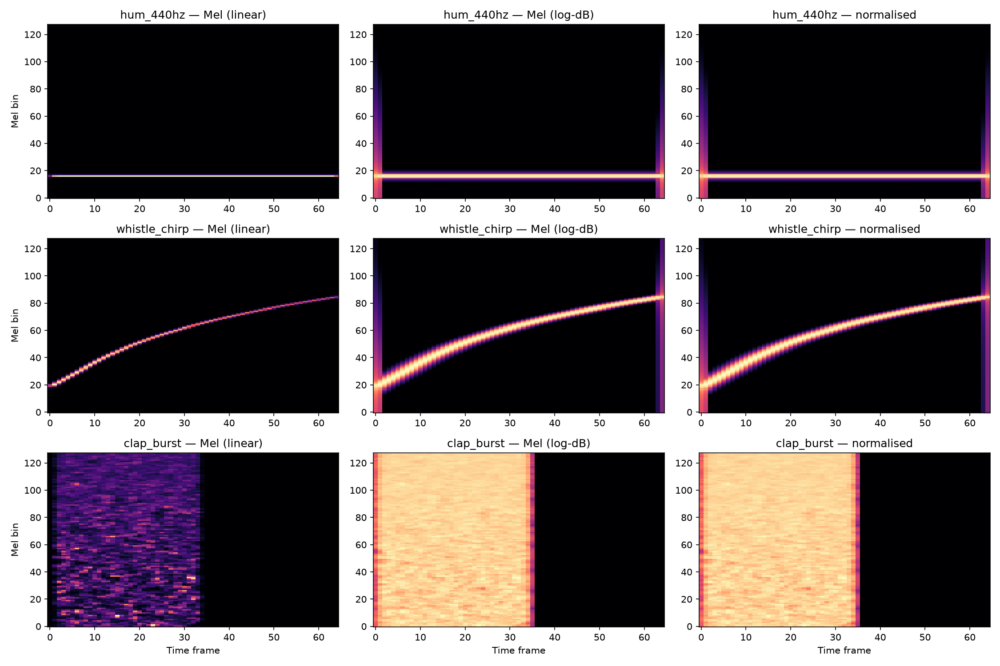

# Mel-Spectrograms — From Sound to Tensor

The core transform in this pipeline. Takes a raw waveform and produces a compact, perceptually-weighted image of its frequency content over time.

---

## The problem with raw audio

A 1.5-second clip at 22050 Hz is 33,075 numbers — one amplitude value per sample. That's a lot of data with very little structure. A neural network *can* learn from raw waveforms, but it has to rediscover frequency decomposition on its own. We'd rather hand it something structured.

> **Coming from signal processing or C:** This is the same reason you'd FFT a buffer before analysing it — time-domain data hides the frequency content you actually care about.

---

## Step 1: STFT (Short-Time Fourier Transform)

The STFT breaks audio into overlapping windows and runs an FFT on each one.

- **`n_fft=2048`** — window size. Larger = better frequency resolution, worse time resolution. 2048 at 22050 Hz gives ~93ms windows — good enough for musical sounds.
- **`hop_length=512`** — how far the window slides between frames. 512 samples = ~23ms between frames. Our 1.5s clip produces **65 time frames**.
- Output: a 2D array of shape `(1025, 65)` — 1025 frequency bins × 65 time steps.

Each cell holds the magnitude (energy) at that frequency during that time window.

> **Coming from JS/TS:** If you've used the Web Audio API's `AnalyserNode.getFrequencyData()`, that's one column of this matrix — the STFT is just doing that for every overlapping window across the whole clip.

> **Coming from C:** Think of sliding a 2048-sample buffer across the signal with a 512-sample stride, applying `fftw_plan_dft_r2c_1d` to each window, and stacking the magnitude outputs as columns.

---

## Step 2: Mel filterbank

The STFT gives 1025 linearly-spaced frequency bins. But human hearing isn't linear — we're much more sensitive to differences at low frequencies than high ones. The interval 200→400 Hz sounds like an octave jump; 8000→8200 Hz is barely noticeable.

The **Mel scale** compresses high frequencies and expands low ones to match perception. A Mel filterbank is a set of overlapping triangular filters applied to the STFT output:

- Low frequencies → narrow filters (fine detail where we hear differences)
- High frequencies → wide filters (coarse, because we can't tell them apart)

With `n_mels=128`, we go from 1025 frequency bins to 128 Mel bands. The output shape becomes `(128, 65)`.

**Why this matters for the model:** The Mel filterbank does dimensionality reduction and perceptual weighting in one step. It throws away frequency detail that humans (and therefore our labels) can't distinguish, and keeps the detail where it matters.

---

## Step 3: Log-dB conversion

Human perception of loudness is logarithmic — doubling the sound energy doesn't sound "twice as loud." Converting to decibels (dB) with `librosa.power_to_db` compresses the dynamic range:

- A quiet frequency at power 0.001 and a loud one at power 1.0 differ by 1000×. In linear scale, the quiet one is invisible.
- In dB: the quiet one is -30 dB and the loud one is 0 dB. Now both are visible and the model can learn from both.

The `amin` parameter (default `1e-10`) floors silence at -100 dB instead of negative infinity.

---

## Step 4: Normalisation

Different recordings have different absolute volumes. A hum recorded on a laptop mic at arm's length vs. a hum recorded on a studio condenser mic will have completely different dB ranges — but they represent the same sound.

**Per-spectrogram normalisation** (mean=0, std=1) removes this bias:

```
normalised = (spectrogram - mean) / std
```

After this, the model sees *relative* patterns within each spectrogram, not absolute volume levels. A quiet recording and a loud recording of the same sound produce similar normalised spectrograms.

**Edge case:** A completely silent signal has std ≈ 0. Dividing by near-zero explodes the values. The code returns all-zeros for silent input — which makes sense: silence contains no features.

> **In practice:** This is feature scaling — the same `StandardScaler` or z-score normalisation you'd apply to any ML feature set. Financial data needs it (stock prices vs. trading volumes differ by orders of magnitude). Sensor data needs it (temperature in Celsius vs. pressure in Pascals). The principle is identical: put all features on a comparable scale so the model doesn't fixate on whichever feature happens to have the largest numbers.

---

## The full pipeline

```
raw waveform (33,075 samples)
  → STFT (1025 freq bins × 65 time frames)
  → Mel filterbank (128 Mel bands × 65 time frames)
  → log-dB (same shape, compressed dynamic range)
  → normalise (mean=0, std=1)
  → PyTorch tensor (1, 128, 65) — ready for a CNN
```

The leading `1` is the channel dimension — like a single-channel (greyscale) image. The CNN will treat this as a 128×65 image where brightness means "energy at this frequency during this time window."

---

## What our samples look like



Three columns show the progressive transformation:

| Sample | Linear Mel | Log-dB | Normalised |
|--------|-----------|--------|------------|
| **hum_440hz** | Bright line at low Mel bins. Energy concentrated at one frequency. | Same line, but background detail now visible. | Relative contrast enhanced — the line stands out sharply. |
| **whistle_chirp** | Rising diagonal — frequency sweeping upward over time. | Sweep visible with more harmonic detail. | Clean sweep pattern, ready for a model to learn. |
| **clap_burst** | Broadband burst in the first half — energy everywhere at once. | The log scale reveals the full structure of the impulse. | Clear boundary between burst and silence. |

These three sound types have *visually distinct* spectrogram patterns. That's exactly what makes them classifiable — the CNN will learn these shapes.

---

## Key parameters

| Parameter | Default | What it controls |
|-----------|---------|-----------------|
| `n_fft` | 2048 | Frequency resolution (more bins = finer frequency detail, coarser time detail) |
| `hop_length` | 512 | Time resolution (smaller hop = more time frames = finer time detail) |
| `n_mels` | 128 | Number of Mel bands (more = finer perceptual frequency detail) |
| `target_frames` | None | If set, pad/truncate to this many time frames for consistent tensor shapes |

For 1.5-second clips at 22050 Hz with these defaults: output is always `(1, 128, 65)`.
