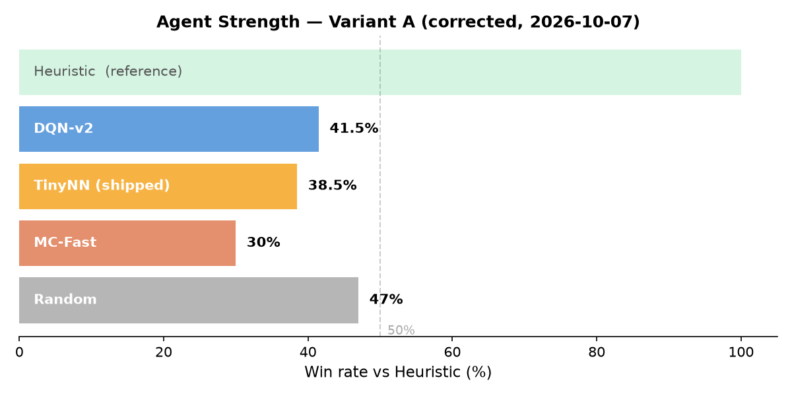
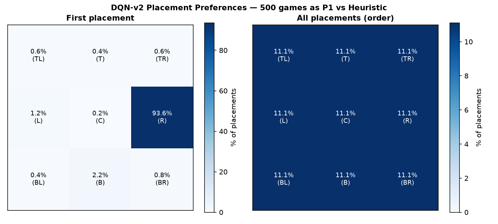
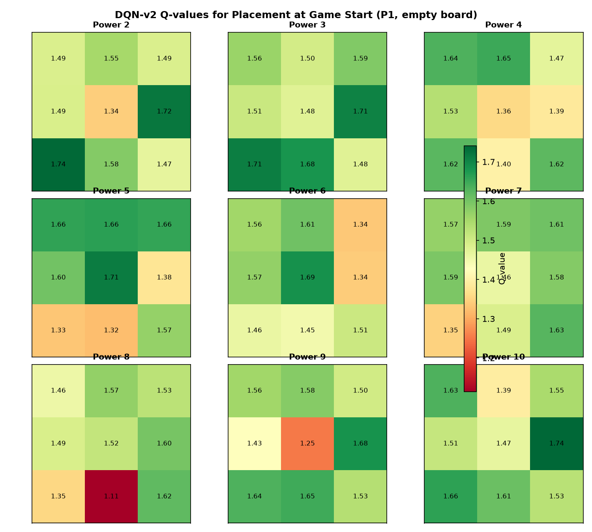

# Reinforcement Learning

## What is it?

Reinforcement learning (RL) is a class of learning where an agent learns by interacting with an environment. Instead of being given labelled training examples ("this input should produce this output"), the agent receives a **reward signal** — a scalar that tells it how well it did after each action. It learns a **policy** (which action to take in each state) by exploring actions and updating its behaviour based on accumulated reward.

RL is the right tool when:
- You don't have labelled examples of good decisions
- The optimal behaviour depends on long-term consequences, not just immediate reward
- The environment can be simulated (or is cheap to interact with)

---

## Key concepts

### State, action, reward

At each timestep the agent observes the **state** (everything it can see about the environment), chooses an **action**, receives a **reward**, and transitions to a new state. This loop is the Markov Decision Process (MDP) — the formal framework underpinning all RL.

In Utala KAOS 9:
- **State:** 80-dimensional vector encoding board positions, piece values, deck state, game phase
- **Action:** one of 95 possible actions (place a rocketman, play a weapon, choose a fight, pass)
- **Reward:** +1 for winning the game, 0 for drawing, -1 for losing — only at game end

### Value functions

Rather than reacting to immediate reward alone, RL agents learn to estimate **long-term value**:

- **V(s)** — value of being in state s: expected total future reward from here
- **Q(s, a)** — value of taking action a in state s: expected total future reward if we take that action then behave optimally

The Q-function is what DQN learns. Given a state, it produces a Q-value for every possible action. The agent picks the action with the highest Q-value.

### Temporal Difference learning

TD learning is the backbone of most practical RL. Instead of waiting for a game to end to update estimates, it bootstraps: after each step it updates its Q-estimate using the estimate from the *next* state.

**TD update:**
```
Q(s, a) ← Q(s, a) + α [r + γ · max_a' Q(s', a') − Q(s, a)]
```

- `r` — immediate reward
- `γ` — discount factor (how much future reward is worth relative to now; `γ < 1` means the agent prefers sooner rewards)
- The term in brackets is the **TD error** — the difference between what the agent expected and what it got

**In Utala:** the Linear TD agent (`LinearValueAgent`) implements this by hand with a weight vector over hand-built features. The DQN replaces the hand-built features with a neural network.

---

## DQN — Deep Q-Network

DQN replaces the weight vector with a neural network that maps state → Q-values for all actions simultaneously. Key additions over basic TD:

### Experience replay

Rather than learning from transitions immediately (which creates correlated updates), transitions `(s, a, r, s')` are stored in a **replay buffer** and sampled randomly during training. This breaks temporal correlation and makes learning more stable.

In Utala: `ReplayBuffer` stores up to 30K transitions. Each training step samples a random mini-batch of 64.

### Target network

A second copy of the network (the **target network**) is used to compute the TD target `r + γ · max_a' Q_target(s', a')`. The target network is updated slowly (either hard copy every N steps, or soft Polyak averaging). This prevents the moving-target problem where the network chases its own changing estimates.

### Epsilon-greedy exploration

The agent can't learn from actions it never tries. During training, it acts randomly with probability ε (epsilon) — exploring — and picks the best known action with probability 1 - ε — exploiting. ε is decayed over time: explore a lot early, exploit more as learning matures.

---

## Curriculum training

Utala's DQN was trained in three stages:

| Stage | Opponent | Games | Purpose |
|-------|----------|-------|---------|
| 1 (0–10K) | Random | 10K | Learn legal play, basic patterns |
| 2 (10K–30K) | Heuristic | 20K | Learn to play strategically against a decent opponent |
| 3 (30K–50K) | 50% Heuristic + 50% self-play | 20K | Consolidate and extend |

Playing only self-play from the start doesn't work — both players are equally bad and learn bad habits together. Starting against Random and then Heuristic gives stable signal before introducing self-play.

---

## Model distillation

Once a large neural network (the **teacher**) has been trained, you can compress its knowledge into a much smaller network (the **student**) by training the student to imitate the teacher's outputs.

Instead of training on game outcomes (win/lose), the student trains on **soft targets** — the teacher's Q-value distribution over all actions. This richer signal transfers more knowledge than hard labels.

In Utala:
- Teacher: DQN (39K params, 80→128→128→95)
- Student: TinyNN (5.7K params, 80→32→95)
- Training: 5K games of teacher play, student learns to match teacher logits

The student runs ~7× faster and is small enough for mobile deployment.

---

## Self-play and the Elo plateau

When an agent plays only against itself, it can reach an equilibrium where it plays consistently but not well — like two beginners practising together. Self-play is most effective once the agent is already competent, and benefits from:
- Diverse opponents (mix self-play with curriculum opponents)
- Lower learning rate in late training (to consolidate rather than overwrite)
- Checkpoint selection (the best model during training, not the final model)

In Utala Phase 5, Stage 3 self-play caused oscillation — the loss climbed as the network tried to track a shifting opponent. The fix was keeping 50% Heuristic in Stage 3 to stabilise the training signal.

---

## Agent performance — Utala KAOS 9 (corrected, Variant A)



All agents below 50% vs Heuristic. DQN is the strongest trained agent at 41.5%, but hasn't cleared the 50% threshold. Re-training against a corrected Heuristic (one that properly defends) is the next step.

---

## What the DQN learned — placement heatmap



First-placement preference over 500 games. The DQN places its opening piece on the **Right-middle square 93.6% of the time** — a near-deterministic opening strategy. This may reflect exploitation of a Heuristic that was trained against a broken opponent. Post-retrain comparison will show whether this changes.

---

## What the DQN values — Q-value heatmap at game start



Q-values for placing each rocketman power on each grid square at an empty board. Key observations:
- **Power 9** strongly avoids center (Q=1.25, brightest red) — unexpected, since Heuristic treats center as the key position
- **Power 10** (face-down piece) prefers bottom-right (Q=1.74)
- **Power 8** has a low Q for bottom-center (Q=1.11, deep red)

These patterns reflect what the DQN learned when playing against a Heuristic that never defended — the valuations may shift significantly after retraining.

---


RL maps to a wide class of business problems:

- **Recommendation systems:** the agent is the recommender, the action is what to show next, reward is engagement/conversion. Q-learning and policy gradient methods underpin much of Netflix and Spotify.
- **Dynamic pricing:** the agent sets a price, observes demand, receives revenue as reward. Learns the demand curve without being given it.
- **Process automation:** an agent navigates a UI or workflow, receives reward for task completion. Q-learning trained on simulation before deploying on the real system.
- **Adaptive difficulty:** an RL agent adjusts challenge level based on player performance, maximising engagement. This is exactly `acoustic-odyssey/echo`.

The core skill transfer: RL produces systems that learn from interaction rather than supervision. Wherever you can define a reward signal and simulate the environment, RL is the tool.
