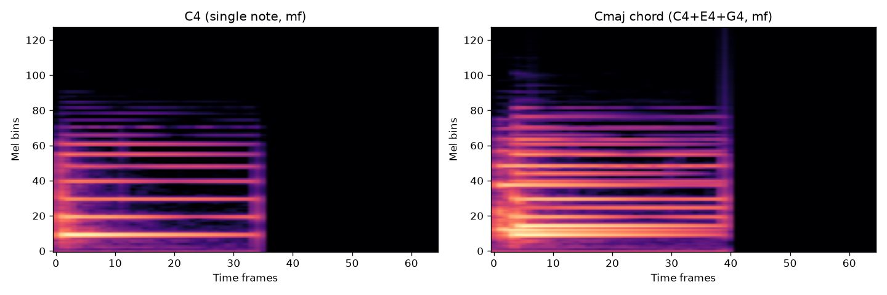

# Chord Synthesis — Mixing Notes in the Time Domain

Phase 4 needs chord data: multiple notes played simultaneously. Rather than recording a piano, we synthesise chords by mixing individual Iowa piano note recordings together mathematically.

This is the same principle used in audio production, digital signal processing, and anywhere multiple data streams need to be combined into one.

---

## What a chord is here

A chord is two or more notes played at the same time. In the time domain — the raw waveform — playing C4 and E4 simultaneously means the air pressure at your ear is the *sum* of both pressure waves. We recreate that by adding the two waveforms together as numpy arrays.

```python
# Simplified: C4 + E4 + G4 = Cmaj
mixed = c4_wave + e4_wave + g4_wave
```

That's the core idea. Everything else is to prevent problems with that addition.

---

## The clipping problem

Each Iowa note was recorded at full dynamic range. If C4, E4, and G4 are all near peak amplitude (±1.0), their sum can exceed ±1.0 — which produces clipping distortion.

```
C4 amplitude:   0.9
E4 amplitude:   0.8
G4 amplitude:   0.85
Sum:            2.55  ← digital clip: sounds like static
```

The fix is to normalise each note to a lower peak *before* mixing:

```python
def mix_notes(clips):
    normalised = [clip / clip.max() * 0.5 for clip in clips]  # each note → peak 0.5
    mixed = sum(normalised)                                     # max possible: 1.5
    return mixed / mixed.max() * 0.9                           # renormalise result
```

With 3 notes each at peak 0.5, the theoretical maximum sum is 1.5, then we renormalise the result to 0.9. No clipping, full dynamic range preserved.

> **In practice:** This is the same problem as feature scaling in ML — if one feature has values in the thousands and another in the hundreds, the model will pay disproportionate attention to the larger one. Normalising before combining gives each component equal weight.

---

## Dynamic combinations

Each Iowa note has three velocity levels: `pp` (soft), `mf` (medium), `ff` (loud). We synthesise four dynamic combinations per chord:

| Mix | Note 1 | Note 2 | Note 3 | Sounds like |
|-----|--------|--------|--------|-------------|
| 0   | pp     | pp     | pp     | soft chord  |
| 1   | mf     | mf     | mf     | medium chord |
| 2   | ff     | ff     | ff     | loud chord  |
| 3   | pp     | mf     | ff     | uneven — one note louder than others |

Mix 3 (uneven dynamics) makes the dataset more realistic. In real piano playing, fingers don't always hit notes with identical force. A model trained only on uniform dynamics might fail on a chord where one note is louder.

---

## The 6 diatonic triads

We start with the diatonic triads of C major — the 6 chords built entirely from the notes C D E F G A B (no sharps or flats). All 6 use only notes already in `data/raw/notes/`:

| Chord | Notes | Quality |
|-------|-------|---------|
| Cmaj | C4 + E4 + G4 | major (bright) |
| Dmin | D4 + F4 + A4 | minor (darker) |
| Emin | E4 + G4 + B4 | minor |
| Fmaj | F4 + A4 + C4 | major |
| Gmaj | G4 + B4 + D4 | major |
| Amin | A4 + C4 + E4 | minor |

Note that some notes appear in multiple chords — C4 is in Cmaj, Fmaj, and Amin. This is deliberate: it means the model can't detect a chord just from the presence of one note; it has to learn the *combination*.

---

## What the spectrogram looks like

A single note produces one harmonic ladder — a fundamental frequency plus overtones at integer multiples. A chord produces multiple overlapping ladders.

The Cmaj spectrogram has three sets of horizontal lines superimposed: C4's ladder (fundamental ~261 Hz), E4's (329 Hz), and G4's (392 Hz). The ladders don't perfectly align because equal temperament tuning spaces them by frequency ratios, not equal amounts.



The chord (right) shows:
- More active Mel bins — energy spread across more frequency bands
- Higher harmonics reaching further up the Mel axis
- The C4 fundamental ladder is still visible at the bottom — it didn't disappear

This visual distinctiveness is what makes the CNN's job tractable: chords look genuinely different from single notes, not just louder versions of them.

---

## Why time-domain mixing (not frequency-domain)

We could add spectrograms instead of waveforms. But the pipeline expects `.wav` files — it processes audio through the full ingest → augment → feature extraction chain. Mixing in the time domain lets every chord clip pass through the same pipeline as every other recording. Same augmentations, same normalisation, same tensor shape.

Mixing spectrograms directly would bypass augmentation (no pitch shift or time stretch on the chord), and would require writing a separate pipeline path. Time-domain mixing is the simpler, more consistent approach.

> **In practice:** Standardising your data format is almost always worth it. One pipeline that handles everything is easier to test and debug than two pipelines that handle different cases. The same logic applies to normalising data schemas in a warehouse — one canonical format beats "it depends on the source."

---

## Running it

```bash
python scripts/synthesise_chords.py                         # default paths
python scripts/synthesise_chords.py --dry-run               # see what would be written
python scripts/synthesise_chords.py --notes-dir data/raw/notes --output data/raw/chords
```

Then run the pipeline:

```bash
python -m pipeline.batch data/raw/chords data/processed/chords
```

Result: 24 source clips → 168 augmented tensors (28 per chord, 7 augmentations each).

See: [scripts/synthesise_chords.py](../scripts/synthesise_chords.py)
