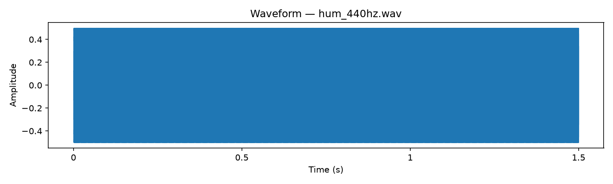
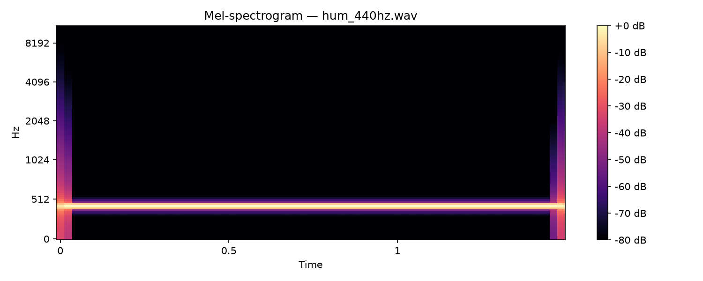

# Reading Waveforms & Spectrograms

The two most common ways to visualise audio. If you can read these, you can sanity-check every step of the pipeline.

---

## Waveform

A waveform plots **amplitude over time**. That's it — how loud the signal is at each moment.

- **X-axis** — time in seconds
- **Y-axis** — amplitude (signal strength), typically -1.0 to 1.0 for normalised audio

**What to look for:**
- **Shape** — a pure tone (like our 440 Hz hum) looks like a solid block because the oscillations are too fast to see individually at this zoom. A clap would show a sharp spike. Speech shows irregular bursts.
- **Silence** — flat line at 0. This is what `trim_silence()` removes.
- **Clipping** — if the waveform hits the top/bottom and flattens, the recording was too loud. Clipped audio loses information.
- **Volume** — taller = louder. A quiet recording will look like a thin line in the middle.

**The limitation:** A waveform shows *when* things happen, but not *what frequencies* are present. A 440 Hz hum and a 880 Hz whistle can look identical in a waveform — both are smooth oscillations. That's why we need spectrograms.

---

## Spectrogram

A spectrogram plots **frequency over time**, with brightness showing intensity. It's what you get when you break the audio into short overlapping windows and run an FFT (Fast Fourier Transform) on each one.

- **X-axis** — time in seconds
- **Y-axis** — frequency (Hz), low at the bottom, high at the top
- **Colour** — intensity in decibels (dB). Bright/yellow = loud at that frequency. Dark/black = quiet or absent.

**What to look for:**
- **Horizontal lines** — a sustained tone. Our 440 Hz hum shows as a bright line at ~440 Hz that runs the full duration. A whistle would be a line higher up.
- **Vertical lines** — a broadband impulse (energy across all frequencies at one moment). A clap or a drum hit looks like this.
- **Curves** — a pitch that changes over time. Our chirp sample (200→800 Hz) would show as a diagonal line sweeping upward.
- **Fuzzy patches** — noise. White noise fills the whole spectrogram evenly. Room noise tends to sit in the low frequencies.

**Why Mel scale?** The Y-axis here isn't linear Hz — it's Mel-scaled. This compresses high frequencies and expands low ones, matching how humans perceive pitch. The difference between 100 Hz and 200 Hz sounds huge; the difference between 5000 Hz and 5100 Hz is barely noticeable. The Mel scale reflects that, so the spectrogram emphasises what matters perceptually.

**The dB colour bar:** The scale on the right shows decibels relative to the loudest point (0 dB = peak). -80 dB means that frequency is essentially silent. Useful for spotting whether your signal actually has energy where you expect it.

---

## Using these to debug the pipeline

| You see | It means | Check |
|---------|----------|-------|
| Waveform is a flat line | Silent or nearly silent recording | Input file, volume, trim threshold |
| Spectrogram is all black | Feature extraction produced zeros | FFT parameters, normalisation |
| Spectrogram has energy everywhere equally | Noise, not signal | SNR too low, augmentation too aggressive |
| Bright band at unexpected frequency | Wrong sample rate or pitch shift | Resample settings, pitch_shift params |
| Spectrogram looks right but model fails | Features are fine — problem is downstream | Check labels, model architecture, training |

More plots will appear as the pipeline grows — augmented variants, batch outputs, model predictions. They all build on these two views.
