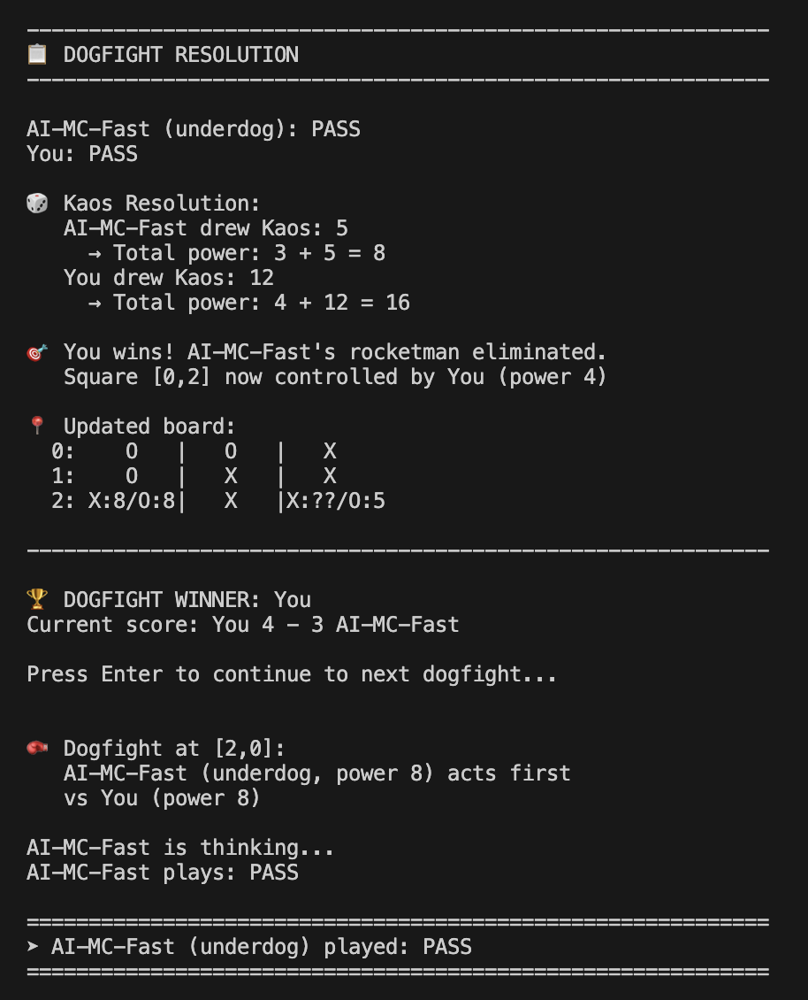

# utala: kaos 9 — AI Research

A study of skill expression, risk management, and learning algorithms through a 2-player tactical grid combat card game.

Everything is text-based, inspectable, and hackable.

---



---

## Quick Start

```bash
./setup.sh              # Python 3.11 venv + dependencies
./run.sh                # Play as human vs AI
python run_tests.py     # 104 tests
```

---

## Approach

Build one game engine and one evaluation harness, then plug in progressively sophisticated decision-making systems and compare them.

### Phase 1 — Baselines (no learning)

Canonical Python engine, deterministic replay, evaluation harness. Baseline agents: random legal, heuristic, Monte Carlo rollout.

**Checkpoint 1 — Is the game worth studying? : PASS**
Pass: stronger agents consistently beat weaker ones, weaker agents still win sometimes, randomness affects close matches not everything. Fail: outcomes dominated by luck or trivial heuristics. **Result: PASS** — Heuristic 65% vs Random, Monte Carlo 79% vs Random, clear skill gradient with meaningful variance.

### Phase 2 — Learning without frameworks

Hand-built learning: TD-linear value agent with manual gradient updates. Fixed state encoding, fixed action space, illegal actions masked by engine.

### Phase 3 — Deep learning

DQN with bluffing-aware 80-dim state features. Imitation learning to distill search/DQN into tiny production models.

### Phase 4 — Rule evolution

Variant A (v1.9): choosable dogfight order — winner picks the next contested square. Action space grows from 86 to 95. Retrained all agents on new rules, validated with invariant checking.

**Checkpoint 2 — Is the game rich enough to require deep learning? : PASS**
Pass: DQN or neural methods outperform hand-crafted heuristics. Fail: linear models match DQN, or heuristic remains unbeatable. **Result: PASS** — DQN reaches 53% vs Heuristic (peak), linear models plateau at 38%. The game rewards pattern recognition beyond what hand-tuned rules capture.

### Phase 5 — Improve, distill, ship *(current)*

Improve DQN to consistent >50% vs Heuristic. Distill into tiny production model. Port Variant A rules and distilled agent to the Flutter game app.

**Checkpoint 3 — Can I improve the DL agent and ship to production? : PASS**

---

## Architecture Rules

- All randomness lives in the engine, never in agents
- Agents only propose actions — never apply, mutate, or validate
- Action space is fixed and fully enumerated; illegal actions are masked, never removed
- Determinism required: explicit RNG seeds, versioned replay format
