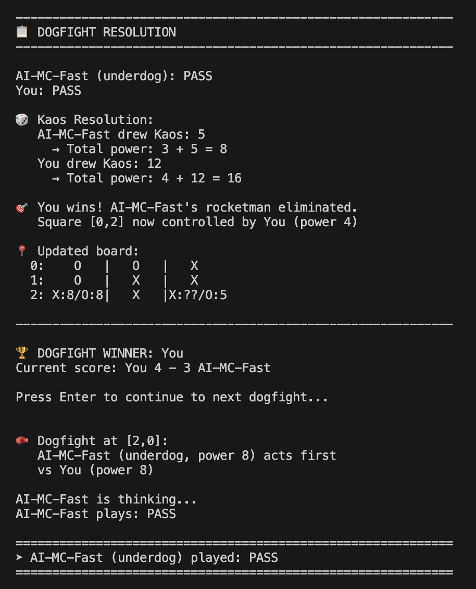

# utala: kaos 9 — AI Research

A study of learning algorithms through a 2-player tactical card game. One engine, one harness — progressively sophisticated agents, compared.

Everything is text-based, inspectable, and hackable.



## Results

| Phase | Method | vs Heuristic | Ships? |
|-------|--------|-------------|--------|
| 1 | Heuristic (baseline) | 50% | Candidate |
| 2 | TD-Linear (27 features) | 47.5% best | Candidate |
| 3 | TinyNN imitation (original rules) | 48% | — |
| 4 | DQN v2, Variant A | 53% peak | — |
| 5 | **TinyNN v2 distilled** | **48%** | **✅ Flutter** |

All phases complete. TinyNN v2 (5,727 params, 0.045ms) ships in the Flutter app.

## Quick start

```bash
./setup.sh          # Python 3.11 venv + deps
./run.sh            # play as human vs AI
python run_tests.py # run tests
```

## Key commands

```bash
# Train
python scripts/train/variant_a/train_dqn.py
python scripts/train/variant_a/distill_dqn.py

# Evaluate
python scripts/eval/run_evaluation.py

# Export
python scripts/export/export_onnx_phase5.py
```

## Learn

- Project log (phases, decisions, results): [LOG.md](LOG.md)
- Full command reference: [DOCS.md](DOCS.md)
- Project-specific explainers: [explainers/](explainers/README.md)
- Shared concept explainers: [../../explainers/](../../explainers/README.md)
- Game rules: [utala-kaos-9.md](utala-kaos-9.md)
