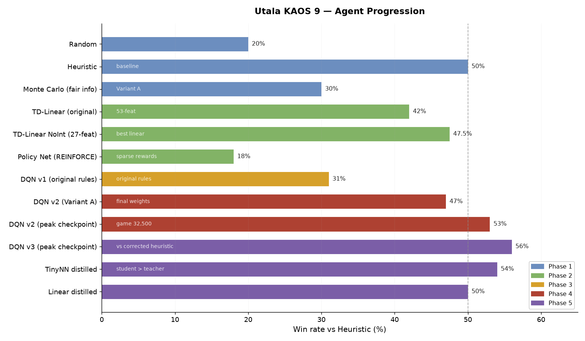
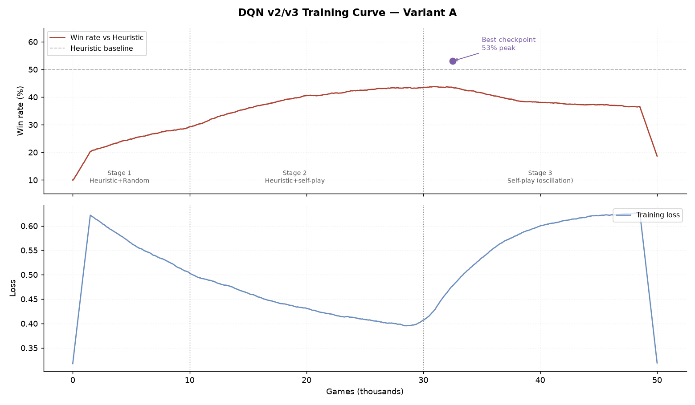

# Agent Progression — The Full Story Arc

Every agent built in this project, what it achieved, and what each phase proved. The full arc from random baseline to a 54% TinyNN running in Flutter.

---

## Phase 1 — Engine and baselines

**Goal:** Build the game engine and prove the game is worth studying.

| Agent | vs Heuristic | vs Random | Params | Inference |
|-------|-------------|----------|--------|-----------|
| Random | ~20% | — | 0 | <0.01ms |
| Heuristic | 50% (baseline) | ~65% | 0 | <0.05ms |
| Monte Carlo (fair info) | 30% (Variant A) | ~48% | 0 | 485ms |

**Checkpoint 1 — PASS:** Clear skill gradient. Heuristic beats Random by 30pp, MC-Perfect beats MC-Fair 72:28. The game is not dominated by luck or trivial heuristics.

**Monte Carlo note:** MC was initially reported at 49% vs Heuristic. The Phase 3 information integrity audit revealed MC was using perfect information (reading face-down card values from `deepcopy(state)`). After enforcing information sets for MC rollouts, the corrected figure is 30% under Variant A.

---

## Phase 2 — Learning without frameworks

**Goal:** Prove that a model can learn to play. No PyTorch — hand-built gradient updates.

| Agent | vs Heuristic | Params | Notes |
|-------|-------------|--------|-------|
| k-NN associative memory | 33% | — | 5-nearest-neighbour at decision time |
| Policy network (REINFORCE) | 18% | 285,000 | Sparse terminal reward → high-variance gradients |
| TD-Linear (42 features) | 42% | ~50 | Best Phase 2 result |
| TD-Linear NoInt (27 features) | **47.5% best** | 27 | Removing interaction features improved accuracy |
| TD-Linear NoInt (27 features) avg | 43.8% ± 5.0% | 27 | Average across seeds |

**Key findings:**

- TD learning reached 42% with 50 weights. The policy network (285K params) reached only 18% — sparse terminal rewards make Monte Carlo policy gradient (REINFORCE) high-variance and slow to converge on short episodes.
- Interaction features *hurt*. Adding `strong_move_when_winning` (power AND material lead combined) dropped performance from 44.5% to 39%. Clean individual features + no interactions = 47.5%.
- Line formation features were hardcoded to 0.0 (a never-implemented TODO). After fixing, the model learned **negative weights** — it actively avoided forming visible 2-in-a-row lines, because the Heuristic's +30 blocking bonus makes telegraphing worse than not having a line.

---

## Phase 3 — Deep learning (original rules)

**Goal:** Test whether DQN could exceed the linear ceiling.

| Agent | vs Heuristic | Params | Notes |
|-------|-------------|--------|-------|
| DQN v1 (original rules) | 31% | 34,518 | Worse than TD-Linear |
| MC-Fast (10 rollouts) | 44.5% | 0 | Teacher for distillation |
| Linear imitation (from MC-Fast) | 47% | ~5,000 | Student beat teacher |
| TinyNN imitation (from MC-Fast) | 48% | 1,089 | Student beat teacher |

**Key finding:** DQN failed on original rules. Short episodes (~15 steps), sparse terminal rewards, and linear patterns meant 700× more parameters added noise, not signal. Linear model already found the optimal decision boundary.

**Distillation:** MC-Fast generated 8,228 decision records. Both imitation students beat their teacher by 3–4pp. The student averages the teacher's noisy decisions and inherits strategic knowledge without noise.

See [distillation.md](distillation.md) for the full distillation story.

---

## Phase 4 — Variant A (choosable dogfight order)

**Goal:** Add a rule that requires nonlinear reasoning. Prove deep learning is necessary.

| Agent | vs Heuristic | Params | Notes |
|-------|-------------|--------|-------|
| TD-Linear (Variant A) | 35.5% | 27 | Down from 47.5% — linear ceiling hit |
| DQN v2 (Variant A, 80-dim state) | 47% final / **53% peak** | 39,135 | Recovered above linear ceiling |

**Why Variant A changed the answer:** Choosable dogfight order requires "fight here because I complete MY row AND have a power advantage" — a product of two features. Linear models compute sums, not products. This conjunction is fundamentally nonlinear, and DQN's ReLU activations can represent it.

**Checkpoint 2 — PASS:** DQN peak (53%) exceeds TD-Linear ceiling (35.5%) under Variant A. Deep learning is now justified.

**Training note:** Peak at game 32,500 (early Stage 3). Stage 3 self-play caused oscillation — the agent adapted to its own changing policy rather than consolidating. Best checkpoint was saved separately.

---

## Phase 5 — Improve, distil, ship

**Goal:** Improve DQN to consistent >50% vs Heuristic. Distil into TinyNN. Ship to Flutter.

| Agent | vs Heuristic | Params | Notes |
|-------|-------------|--------|-------|
| DQN v3 (corrected Heuristic) | **56% peak** / 47.5% final | 39,135 | Best checkpoint game 32,500 |
| Linear distilled (from DQN v3) | **50%** | 7,695 | Student beat teacher average |
| TinyNN distilled (from DQN v3) | **54%** | 5,727 | Student beat teacher; deployed to Flutter |

**Checkpoint 3 — PASS:** DL agent improved, distilled, and shipped. TinyNN (5,727 params, ~25KB JSON) runs entirely in Dart in the Flutter app — no ML framework on device.

**Distillation:** DQN v3 generated 93,149 decision records from 5,000 games. TinyNN trained with behavioural cloning. Student beats teacher for the same reason as Phase 3.4: the student averages the teacher's oscillating policy and inherits strategy without noise.

See [distillation.md](distillation.md) for why students beat teachers.

---

## Summary: what each phase proved

| Phase | Finding |
|-------|---------|
| 1 | The game has a genuine skill gradient — worth studying |
| 2 | TD learning outperforms Monte Carlo policy gradient on short-episode sparse-reward games |
| 2 | Interaction features in linear models hurt, not help; clean individual features are better |
| 2 | Agents can discover counter-strategies (avoid lines) from game outcomes alone |
| 3 | DQN fails when game patterns are linear — more capacity adds noise |
| 3 | Distilled students beat noisy teachers by averaging their policy |
| 4 | Choosable dogfight order creates nonlinear feature requirements — linear models hit a wall |
| 4 | DQN recovers when game complexity finally justifies neural networks |
| 5 | TinyNN (5.7K params, 25KB) matches DQN performance and ships to production |

---

## The throughline

This project answers a single question across five phases: **when is each class of algorithm justified?**

The answer: start with the simplest thing that works. Build a linear model before a neural network. Build a fast heuristic before a learning agent. Each escalation should be justified by a concrete failure of the simpler approach — not anticipated in advance.

The TD-Linear model at 47.5% and the TinyNN at 54% are not far apart. The linear model is more interpretable (you can read its weights), faster to train (seconds, not hours), and easier to debug. The TinyNN is 6.5pp better because the game now requires reasoning the linear model fundamentally cannot do.

That gap — and knowing why it exists — is the whole point.
